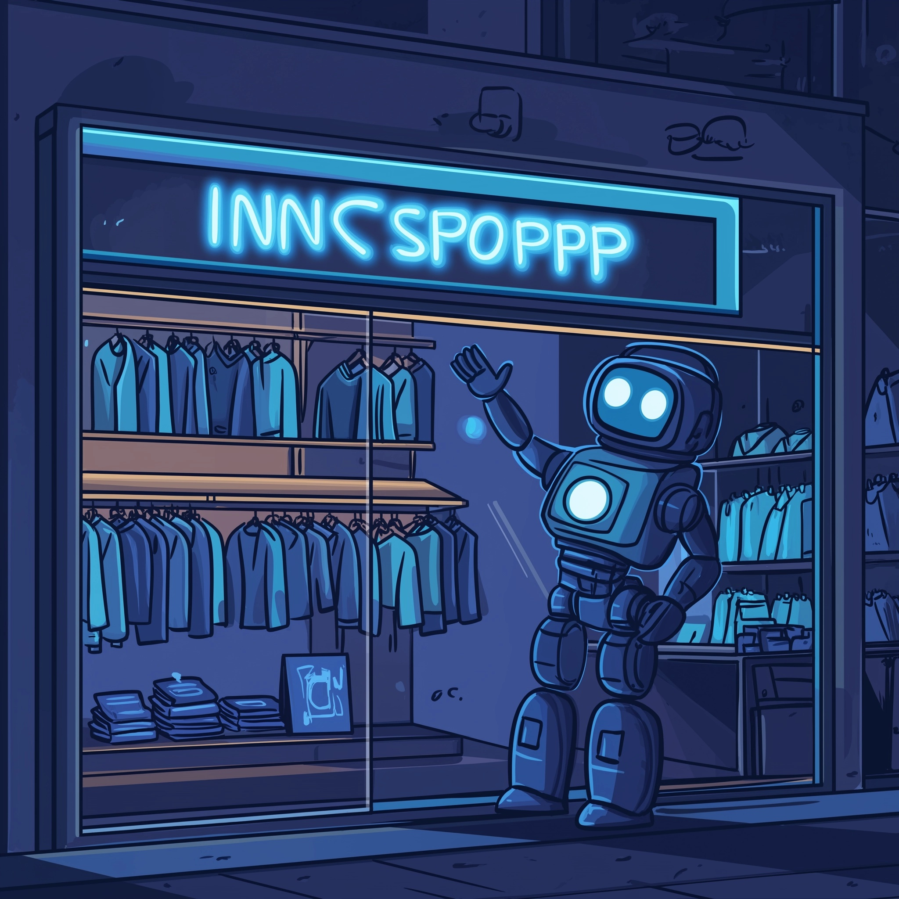

# LangChain Workshop



# Info Support Swagshop

Stel je een webshop voor waar je de meest gave Info Support Swag kunt vinden: denk aan stijlvolle hoodies, unieke gadgets, en toffe accessoires die je met trots kunt dragen op conferenties, bij klanten of gewoon in je vrije tijd. Deze webshop biedt niet alleen de coolste producten, maar maakt het ook super eenvoudig om precies te vinden wat je zoekt.

In deze workshop gaan we aan de slag om een deel van deze webshop te realiseren. We richten ons op het bouwen van een AI-chatbot waarmee je als gebruiker kunt vragen welke producten er beschikbaar zijn en direct bestellingen kunt plaatsen. Daarnaast kun je via de chatbot ook vragen stellen over de producten zelf. Samen werken we toe naar een webshop waar de gaafste Info Support items te koop zijn, zodat jij ze kunt laten zien waar en wanneer je maar wilt. Met behulp van Langchain technologie zullen we deze innovatieve en interactieve winkelervaring creëren.

> [!NOTE]
> Opdrachten in deze workshop zijn te herkennen aan deze speciale tekstblokken.
> De opdrachten zijn direct gerelateerd aan de informatie over LangChain boven het tekstblok.
> Het staat je vrij om de opdracht anders in te vullen, om meer en/of andere functionaliteiten toe te voegen.
> Van alle opdrachten zijn de uitwerkingen te vinden als branch in deze repository.

# Wat is LangChain4j?

LangChain4j is een library dat helpt met het integreren van Artificial Intelligence (AI) in je Java project. Het komt met twee grote voordelen:

1. Uniforme API's: je hoeft je niet langer druk te maken over particuliere APIs van verschillende Large Language Model (LLM) leveranciers of embedding/vector stores. Met LangChain4j kan je makkelijk wisselen tussen leveranciers zonder je code te hoeven herschrijven. Op hun eigen GitHub zeggen ze ook al: "Think of it as a Hibernate, but for LLMs and embedding stores".

1. Comprehensive Toolbox: LangChain4j komt met een lading verschillende tools en handigheidjes voor ons ontwikkelaars om te gebruiken naar het verlangen van ons hart. Dit gaat van simpele prompt templates tot het opzetten van volwaardig Retrieval-Augmented Generation (RAG).

> [!NOTE]
> Clone deze git repository. Deze repository gebruiken we om onze Info Support Swagshop te bouwen.

## Basic integratie met Large Language Model (LLM)

LangChain4j maakt het beginnen met AI in Java zo simpel als de volgende paar stappen:

1. Voeg de LangChain4j dependency, en een LangChain4j model dependeny (zoals OpenAI) toe aan je project. Voorbeeld:

   ```xml
    <dependency>
        <groupId>dev.langchain4j</groupId>
        <artifactId>langchain4j</artifactId>
        <version>0.33.0</version>
    </dependency>

    <dependency>
        <groupId>dev.langchain4j</groupId>
        <artifactId>langchain4j-open-ai</artifactId>
        <version>0.33.0</version>
    </dependency>
   ```

1. Indien van toepassing: verkrijg een API key voor de LLM provider. LangChain4j biedt op hun Github pagina een gratis demo key om met, onder andere, ChatGPT te kunnen testen (https://github.com/langchain4j/langchain4j).
1. Creëer een instantie van het gekozen model in je code, en je kunt al beginnen met chatten! Onderstaande code snippet toont hoe je met twee regels code al met ChatGPT kunt chatten in je app!

   ```java
   ChatLanguageModel model = OpenAiChatModel.withApiKey(yourApiKey);

   String answer = model.generate("Hello World! Greetings from Info Support!");

   System.out.println(answer); // Hello Info Support! It's great to connect with you. How are you doing today?
   ```

> [!NOTE]
>
> 1. Voeg de Langchain4j dependencies toe aan je project.
> 1. Maak een test waarin je met bovenstaande code aan ChatGPT vraagt wat hij van het idee van een Info Support Swagshop vindt. Wat is het antwoord?

Gefeliciteerd, je hebt zojuist AI geintergreerd in een software project! We gaan nu een stap verder en daadwerkelijk functionaliteit implementeren waarmee de gebruiker producten kan bestellen in onze webshop.

We gaan het bouwen als volgt: we maken een command-line applicatie waarmee de gebruiker vragen kan stellen aan de webshop. Een LLM, zoals ChatGPT, wordt in onze applicatie op twee manieren gebruikt:

1. Antwoord geven op de vraag van de gebruiker in natuurlijke taal.
2. Intepretatie van het verzoek van de gebruiker om product informatie op te halen of om een product te bestellen.

We gaan eerst een AI-service configureren zodat we AI verder kunnen gebruiken in onze applicatie.

# AI Services

Om een LLM breder te gebruiken binnen onze applicatie defineren we een `AI-services`-object. Hiermee kun je de LLM die je gebruikt beginnen uitbereiden met de op maat business logica die nodig is. Denk hierbij aan bijvoorbeeld tools, context grootte, prompt injection. De AI Service beheert deze allemaal op een centrale plaats.
Dit kan variëren van simpele berekeningen tot complexe data-analyse of communicatie met externe API's.

Hier is een simpel voorbeeld van het gebruik hiervan:

```java
interface Assistant {
    String chat(String message);
}
```

```java
AiServices.builder(Assistant.class)
    .chatLanguageModel(OpenAiChatModel.builder()
    .apiKey("API_KEY")
    .modelName(OpenAiChatModelName.GPT_4)
    .build())
.build();
```

AI Services beschermt ons tegen vervelende boilerplate en zorgt ervoor dat we gewoon een simpele string als input kunnen gebruiken om onze chat te starten en te configureren. Dit kan verder uitgebreid worden met bijvoorbeeld de context grootte aan te passen:

```java
AiServices.builder(Assistant.class)
    .chatLanguageModel(OpenAiChatModel.builder()
       .apiKey("API_KEY")
       .modelName(OpenAiChatModelName.GPT_4)
       .build())
   .chatMemory(MessageWindowChatMemory.withMaxMessages(10))
   .build();
```

> [!IMPORTANT]
> Opgelet: hoe groter de context grootte, hoe duurder het gebruik hiervan wordt, aangezien hierdoor steeds tokens opgestuurd moeten worden per prompt.

Voor meer informatie over de AI Service, zie de LangChain4j documentatie: https://docs.langchain4j.dev/tutorials/ai-services.

Het AI-services object kunnen we verder configureren door bijvoorbeeld een systemprompt mee te geven;

```java
.systemMessageProvider((var x) -> "Je bent de chatbot voor de Info Support swag shop, een digitale winkel! Houdt antwoorden vriendelijk maar kort")
```

> [!NOTE]
>
> Maak in je project een Configuratie classe waarin je een AiService-object configureert zoals in bovenstaande voorbeelden. Gebruik GPT-4. Een API-key kun je vragen aan de workshop begeleiders.

Met het geconfigureerde object kun je vragen stellen aan je AI-assistent als volgt:

```java
Assistant assistant = Configuration.assistant();
String answer = assistant.chat("How many 'R' are in the word Strawberry?");
```

> [!NOTE]
> Voeg een CLI-interface toe aan de `main()` methode en stel de vragen van de gebruiker direct aan de assistent.

<details>

<summary>Hoe voeg je een basis CLI interface toe?</summary>

```java
Scanner scanner = new Scanner(System.in);

System.out.println("Dit is het begin van jouw gesprek met de Info Support swag shop chatbot!");
System.out.print("[input]: ");

while (scanner.hasNext()) {
   String in = scanner.nextLine();

   String answer = assistant.chat(in);
   System.out.println("[output]: " + answer);
   System.out.println();
   System.out.print("[input]: ");
}
```

</details>

Nu zijn we klaar om eigen business logica te schrijven zodat onze gebruikers producten kunnen bestellen in onze swagshop. Wat we hiervoor nodig hebben is een manier om het verzoek van de gebruik juist te intepreteren.
Het intepreteren van het verzoek van de gebruiker kunnen met Langchain doen middels `Tools`.

# Tools (Function Calling)

In Langchain4j zijn Tools functies die een AI-agent kan gebruiken om specifieke taken uit te voeren, zoals het ophalen van informatie, berekeningen maken, of interactie met andere systemen. Ze fungeren als uitbreidingen die de mogelijkheden van AI verbreden door toegang te bieden tot externe bronnen of acties. Tools helpen de AI om betere en nuttigere antwoorden te geven door gericht specifieke acties te ondernemen. Door Tools te integreren in een AI-applicatie, kan je de bruikbaarheid en efficiëntie van je AI-oplossing aanzienlijk vergroten.

De LLM roept de code niet direct aan, het model geeft de intentie aan om een Tool aan te roepen en LangChain4j zorgt ervoor dat de methode uitgevoerd wordt en het resultaat teruggegeven wordt aan de LLM.

> [!IMPORTANT]
> Large-language models lijken tegenwoordig alles te kunnen: volledige applicaties bouwen, je het antwoord te geven op de vraag van het leven en een volledige Langchain workshop genereren (Geintje, natuurlijk). Maar een LLM kan niet alles. Hij kan niet zo goed rekenen [of je vertellen hoevaak de letter 'r' in _strawberry_ zit](https://community.openai.com/t/incorrect-count-of-r-characters-in-the-word-strawberry/829618). Voor de zaken die een LLM niet kan, kunnen we zelf `Tools` implementeren.

Stel dat je een chatbot wilt die belasting berekent. Je kunt dan een Tool maken die deze berekening doet. De chatbot gebruikt deze Tool om direct het juiste antwoord te geven. In code ziet dat er zo uit:​

```java
static double BTW = 0.21d;

@Tool("Berekend de BTW op een gegeven prijs")
double berekenBTW(double prijs){
    return prijs * BTW;
}
```

Een Tool bestaat uit een methode, `double berekenBTW(double prijs)`, een `@Tool`-annotatie en een implementatie. In de `@Tool()`-annotatie vertel je aan Langchain wat deze methode doet.

Als je nu aan de chatbot vraagt om de BTW te berekenen over een bepaalde prijs, kan de chatbot de `berekenBTW(..)` methode aanroepen en het resultaat gebruiken om de gebruiker het juiste antwoord te geven.
Het is mogelijk extra context aan het model te geven via de `@P(..)` annotatie op de Tool parameter(s).

Voor meer informatie over Tools, zie de LangChain4j documentatie: https://docs.langchain4j.dev/tutorials/tools/.

Om Tools toe te voegen aan onze applicatie definieren we een classe, `KlantTools`. In deze classe implementeren we de functionaliteit die onze swagshop zou moeten ondersteunen. Bijvoorbeeld:

```java
class KlantTools {
   private static final Database database = Database.init();

   @Tool("Creates and returns a new customer")
   Customer createCustomer(@P("Customer name") String name) {
      return database.createNewCustomer(name);
   }
}
```

Vervolgens configureren we onze AI-services om te vertellen van welke tools de AI-assistant gebruik kan maken.

```java
.tools(new KlantTools())
```

> [!NOTE]
> Implementeer functionaliteit in de `KlantTools`-classe. Maak gebruik van de in-memory database zoals geimplementeerd in de `Database`-classe. Je kunt denken aan de volgende functionaliteiten:
>
> 1. Aanmaken van een nieuwe klant en het ophalen ervan via naam of id.
> 2. Haal een product via naam of id op.
> 3. Maak een nieuwe order aan.
> 4. Update een bestaande order met een extra orderline.
> 5. (Extra): Zorg dat de chatbot de totaalprijs van een bestelling kan teruggeven (incl. 21% btw!).
>
> Alle nodige methodes zijn aanwezig, je hoeft enkel de Tools te schrijven.

<details>
<summary>Benieuwd wat LangChain4j onderwater aan het doen is?</summary>

Je kunt de berichten die LangChain4j lokaal heen en weer stuurt met het model inzichtelijk krijgen door:
- In ```simplelogger.properties``` bestand loglevel op ```debug``` te zetten.
- In ```Configuration.java``` bij het aanmaken van het model, ```logRequests(..)``` en/of ```logResponses(..)``` op true te zetten.

</details>


# Retrieval Augmented Generation (RAG)

RAG is een combinatie van verschillende technieken om LLM's te voorzien van domein specifieke kennis of particuliere data. Door relevante informatie uit lokale bronnen mee te sturen in de prompt, kan de LLM deze extra informatie gebruiken om een antwoord te formuleren.

Simpel gesproken bestaat RAG uit twee onderdelen/processen: de inname van data, en het ophalen van data. LangChain4j biedt de nodige tools om beide data pipelines op te zetten.


De "data ingestion" pipeline.


De "data retrieval" pipeline.

Zoals je ziet komen er veel onderdelen kijken bij het opzetten van RAG. Gelukkig maakt LangChain4j het sinds kort makkelijk door middel van "EasyRAG".

EasyRAG komt als een aparte dependency en is bedoeld om je snel met RAG te laten spelen, zonder al te veel te hoeven nadenken over de ingestion en retrieval pipelines, vector stores of embedding models. Verwijs simpelweg naar de documenten en LangChain4j verzorgt de rest.

```xml
<dependency>
   <groupId>dev.langchain4j</groupId>
   <artifactId>langchain4j-easy-rag</artifactId>
   <version>0.33.0</version>
</dependency>
```

> [!NOTE]
> 
> Voeg de LangChain4j EasyRAG dependency toe aan het project

Om aan de slag te gaan met EasyRAG moet de Assistant met de volgende onderdelen uitgebreid worden:

1. Het laden van je documenten:

```java
List<Document> documents = FileSystemDocumentLoader.loadDocuments("/path/to/files");
```

2. Het aanmaken van een embedding store en het vullen ervan:

```java
InMemoryEmbeddingStore<TextSegment> embeddingStore = new InMemoryEmbeddingStore<>();
EmbeddingStoreIngestor.ingest(documents, embeddingStore);
```

3. Je AIService uitbreiden met de embedding store:

```java
.contentRetriever(EmbeddingStoreContentRetriever.from(embeddingStore))
```

> [!NOTE]
> 
> In de resources directory hebben we tekst bestanden met beschrijvingen en informatie over de voorwerpen.
> Voer de bovenstaande drie stappen uit om jouw chatbot RAG mogelijkheden te geven:
> 1. Laden van documenten
> 2. Aanmaken embedding store
> 3. AI Service uitbreiden met embedding store
>
> Voorbeelden van vragen die je chatbot vervolgens kan beantwoorden:
>
> - **Vraag**: Wat is de prijs van een hoodie?
> - **Antwoord**: 45 euro.
> 
> 
> - **Vraag**: Waar kan ik de gratis poster ophalen?
> - **Antwoord**: bij binnenkomst, bij de balie.
> 
> 
> - **Vraag**: Hoe kom ik aan een gouden sleutelhanger?
> - **Antwoord**: alleen op verzoek
> 
> 
> - **Vraag**: Welke maten t-shirts zijn nog beschikbaar?
> - **Antwoord**: Alles van XS t/m XXL, met uitzondering van L.
> 
> 
> - **Vraag**: Hoeveel kost de 16 TB USB-stick?
> - **Antwoord**: 160 euro

Je kunt de nodige stappen voor EasyRAG hier teruglezen: https://docs.langchain4j.dev/tutorials/rag#easy-rag

# Extra: Image Generation
Het is sinds kort ook mogelijk om foto's te genereren via ChatGPT 4. Dat kun je hier ook via code doen. Probeer daar eens mee te spelen en zie wat je daaruit mee kan toveren. Dat zit ook mee in LangChain4j.
> Tip: In ChatGPT kun je gewoon prompten en een foto krijgen net zoals bij tekst, maar achterliggend werkt dat met een volledig ander model.

> Opgelet: Dit gebruikt best veel tokens, dus ongecontrolleerd gebruik hiervan kan snel duur worden.